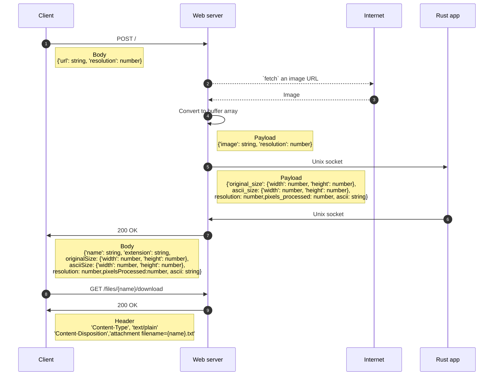

# UTAAF (*U*rl *T*o *A*scii *A*rt _Format_) 🐦


## Summary

- 🦜 [What it utaaf](#-what-is-utaaf)
- 🐳 [Use locally with _docker compose_](#-using-docker-compose)
- 🖥️ [Use locally by starting all servers](#️-starting-all-servers)
- 🚀 [And then...](#-and-then)
- 📊 [Sequence diagram](#-sequence-diagram)

## 🦜 What is utaaf

A little web server to play with
[unix socket](https://en.wikipedia.org/wiki/Unix_domain_socket) and
[ascii art](https://en.wikipedia.org/wiki/ASCII_art).

With _utaaf_ you can paste a image URL and generate a text based (ASCII) representation of it

### 🐳 Use locally with _docker compose_

```bash
docker compose up
```

### 🖥️ Use locally by starting all servers

You need to create _.env_ file, and then you need to start a
[NestJs](https://nestjs.com/) web Server and a [Rust](https://rust-lang.org/fr/)
socker server which converts the data into Ascii Art.

#### Prerequisites ⚠️

Install [nodeJs](https://nodejs.org/en/download) and
[Rust](https://rust-lang.org/learn/get-started/)

#### Create _.env_ file 📃

```bash
cp .env.example .env
```

#### NestJs Web Server 😺

```bash
cd /typescript
npm i
npm run start
```

#### Rust web socket server 🦀

```bash
cd /rust
cargo run
```

### 🚀 And then...

Go to [http://localhost:3000](http://localhost:3000)

### 📊 Sequence diagram 


